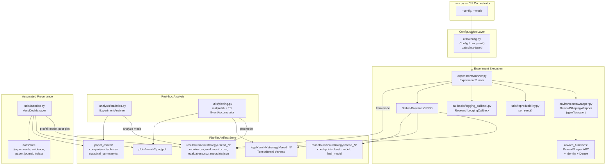
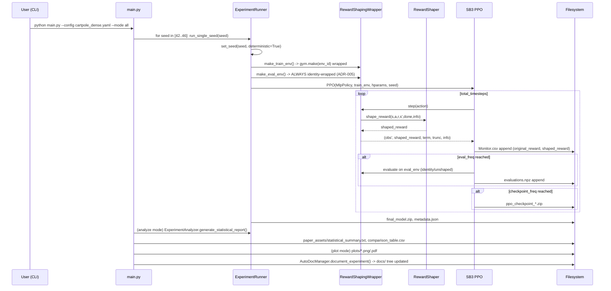
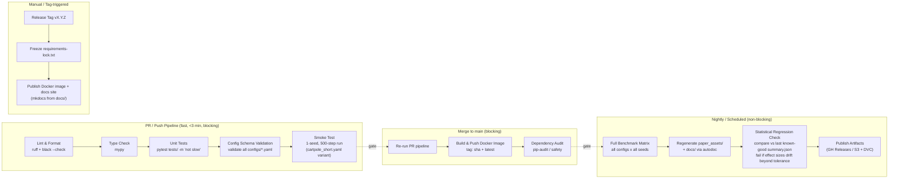

# RL-ResearchLab — Technical Design Review
### Internal Architecture & Research Methodology Assessment
**Reviewed artifact:** `RL-ResearchLab-main.zip` → active module: `reward-shaping-ppo`
**Review type:** First-principles reverse engineering, as prepared for a research lab design review

---

## 0. Executive Summary

RL-ResearchLab is a **single-experiment, CPU-scale RL research scaffold** currently instantiated around one concrete study: *does reward shaping improve PPO sample efficiency on `CartPole-v1`?* The repository is not yet a "platform" in the infrastructure sense — it is a **very well-organized single-project research repo** with platform-shaped seams (factories, ABCs, config schemas) that anticipate future generality but have only ever been exercised by two reward strategies (`identity`, `dense`) on one environment.

The most striking property of this codebase is the **inversion of effort between research engineering and research documentation tooling**. The actual RL surface area — one wrapper, one abstract class, two ~40-line shaper implementations — is small and clean. The documentation/provenance system (`utils/autodoc.py`, the `docs/` tree, ADRs) is comparatively large, templated, and automated to a degree usually seen in mature labs. This tells us a lot about developer intent (see §3).

The empirical result the repo currently contains is actually a **null result with a methodological red flag**: on `CartPole-v1`, both `identity` and `dense` shaping converge to the reward ceiling (500.0) with **zero variance across all 5 seeds**, producing a `NaN` t-statistic (undefined when both groups have zero variance) and a Mann-Whitney p-value of 1.0. This is a textbook **ceiling-effect confound** — `CartPole-v1` is too easy for PPO with this network size to be a discriminating testbed for reward-shaping effects at 100k steps. This is addressed in detail in §6.

Maturity level: **Prototype / Tier-0 research scaffold**, well short of "production-grade platform," but with above-average scientific hygiene (seeding, held-out evaluation environments, confidence intervals, ADRs) relative to typical solo research repos.

---

## 1. What Problem Is This Repository Solving?

Two problems are being solved simultaneously, at different levels of abstraction:

1. **Object-level scientific question:** Does injecting a dense, hand-crafted potential-adjacent penalty term (`-(w_pos·|x| + w_angle·|θ|)`) into `CartPole-v1`'s sparse `+1`-per-step reward change PPO's sample efficiency or asymptotic performance, and does it risk **policy subversion** (Ng et al.'s classic reward-shaping failure mode) relative to an unshaped identity control?

2. **Meta-level infrastructure question:** How do you build an experiment harness where reward-shaping strategies are pluggable, seeds are controlled, evaluation is decoupled from training reward, and every run is automatically archived into a reproducible, citable, paper-ready artifact trail?

The repository is explicit that (2) is scaffolding for a much larger roadmap — the top-level `README.md` states the intent to expand into *"sample-efficient RL, multi-agent systems, RL for LLM agents, and self-improving AI agents."* This means the current `reward-shaping-ppo` submodule should be read less as "the project" and more as **the reference implementation for a pattern the author intends to replicate** across future submodules (a monorepo-of-studies structure, akin to how DeepMind's `acme` or a lab's internal `experiments/` directory hosts many self-contained studies against a shared set of conventions).

---

## 2. Research Objective

Stated formally, in the language the repo itself uses (`docs/research/*.md`, `reward_functions/dense.py` docstrings):

- **Independent variable:** reward-shaping strategy ∈ {`identity`, `dense`}
- **Dependent variables:** (a) unshaped evaluation reward at convergence, (b) timesteps-to-threshold for reward levels {100, 200, 300, 400, 500}, (c) training wall-clock time
- **Controlled variables:** PPO hyperparameters (identical `cartpole_baseline.yaml` / `cartpole_dense.yaml`), network architecture (`[64,64]` MLP for both policy and value heads), seeds (`[42,43,44,45,46]`), total timesteps (100,000), evaluation protocol (`EvalCallback`, 10 episodes, every 5,000 steps, deterministic actions, **on the unshaped identity-wrapped environment regardless of training strategy** — this is ADR-005, and it is the single most scientifically important design decision in the repo)
- **Hypothesis under test:** dense shaping improves early-phase sample efficiency (steps-to-threshold for low reward bands) without degrading asymptotic performance or causing subversion, per PBRS theory referenced in the README (Ng, Harada & Russell 1999).

This is a legitimate, well-posed ablation study design. The weakness is not in the *design* of the causal question — it's in the **choice of environment as a testbed for that question** (§6).

---

## 3. Current Maturity Level

Using a five-tier maturity rubric (Prototype → Reproducible Study → Benchmarked Suite → Research Platform → Production RL System):

| Tier | Criteria | Status |
|---|---|---|
| **0 — Prototype** | Code runs, produces a result | ✅ Met |
| **1 — Reproducible Study** | Seeded, deterministic, config-driven, statistically analyzed, versioned artifacts | ✅ Mostly met (deterministic flags, multi-seed, CI95, t-test/Mann-Whitney/Cohen's d) |
| **2 — Benchmarked Suite** | Multiple environments, multiple algorithms, standardized leaderboard-style comparison, environment-agnostic strategy library | ❌ Not met — single env (`CartPole-v1`), single algorithm (PPO via SB3), 2 strategies |
| **3 — Research Platform** | Distributed/parallel execution, experiment tracking (W&B/MLflow), hyperparameter sweeps, artifact registry, CI/CD, dependency lockfiles, containerization | ❌ Not met at all — no CI, no Docker, no lockfile, no experiment tracker, sequential `DummyVecEnv` only |
| **4 — Production RL System** | Serving, monitoring, rollback, online evaluation, safety gating | ❌ N/A — out of scope for current stage |

**Verdict: solidly Tier 1, with Tier-3-shaped documentation scaffolding (ADRs, autodoc) that outpaces the Tier-0/1 engineering underneath it.** This mismatch is not a criticism so much as a diagnostic: the author is investing early in the *conventions* a lab needs (decision records, experiment manifests, evidence catalogs) before the *infrastructure* a lab needs (CI, containerization, tracking, parallelism) exists. That's a defensible sequencing for a solo/small-team research effort, but it needs to reverse before "platform" claims are credible.

---

## 4. Intended Users

Inferred from artifacts, not stated directly:

1. **The primary author, in a near-future state**, running many more strategies/environments and relying on `autodoc.py` to avoid manual write-ups — i.e., **the documentation system is a tool built for the author's own future self**, not (yet) for external contributors.
2. **A thesis/paper committee or PIEMR academic reviewer** — the emphasis on IEEE/ACM-style statistical rigor (Welch's t-test, Mann-Whitney U, Cohen's d, 95% CI, `paper_assets/` directory literally named for manuscript assembly) strongly suggests this repo is instrumented to produce a citable results section, consistent with the broader pattern (per prior work) of producing IEEE/ACM-style papers from these projects.
3. **A future open-source contributor**, per the README's "How to Add New Reward Shaping Strategies" walkthrough — this section is written at tutorial quality and is the strongest piece of *external-facing* documentation in the repo, but it is undercut by the absence of `CONTRIBUTING.md`, issue templates, or CI that would actually validate a contributor's PR.

There is no evidence of an MLOps/deployment user, and no evidence of a multi-researcher team (no `CODEOWNERS`, no branch protection artifacts, no per-contributor experiment namespacing).

---

## 5. Overall Architecture

### 5.1 Component Map



### 5.2 Data / Control Flow for a Single Run



### 5.3 Architectural Pattern Inventory

| Pattern | Where | Assessment |
|---|---|---|
| **Strategy pattern** (pluggable reward shaping) | `RewardShaper` ABC + `get_reward_shaper()` factory | Textbook-correct. Genuinely open/closed — adding a shaper never touches `runner.py` or `wrapper.py`. |
| **Decorator / Wrapper pattern** | `RewardShapingWrapper(gym.Wrapper)` | Correct use of Gymnasium's own extension mechanism rather than monkey-patching or forking env classes (explicitly reasoned through in ADR-006). |
| **Config-object pattern** | `utils/config.py` dataclasses | Reasonable, but hand-rolled — see §7 for the fragility this introduces. |
| **Template Method-ish orchestration** | `ExperimentRunner.run_single_seed` / `run_all` | Fine for sequential single-machine execution; does not generalize to distributed execution without rework. |
| **Convention-over-configuration artifact layout** | `{results,logs,models,plots}/<env_id>/<strategy>/seed_<n>/` | Consistent and predictable — this predictability is what makes `ExperimentAnalyzer` and `AutoDocManager` possible via `glob.glob` rather than a manifest/database. This is also its biggest scaling risk (§8). |
| **Post-hoc documentation generation** | `AutoDocManager` | Unusual for a repo this size — effectively a bespoke, template-string-based static site/report generator bolted onto the training pipeline. |

---

## 6. Deep Technical Review of the Core Research Logic

### 6.1 The Reward Shaping Abstraction

`RewardShaper.shape_reward(state, action, reward, next_state, done, info)` is a clean, general interface. However, it is **not currently PBRS-compliant**, despite the README's extensive mathematical framing around Potential-Based Reward Shaping:

- `DenseRewardShaper` computes `F(s') = max_bonus - (w_pos·|x'| + w_angle·|θ'|)`, a function of `s'` alone, added directly to `r`. This is **not** of the PBRS form `F(s,a,s') = γΦ(s') − Φ(s)`; it is a *static per-state penalty*, not a potential-difference term.
- Because it's not a potential difference, **Ng et al.'s policy-invariance guarantee does not apply here** — the repo's own ADR and docstrings correctly flag this as a risk ("risk of policy subversion... if weights are not properly balanced") but the shipped strategy is exactly the naive shaping form the PBRS literature was written to caution against, not an implementation of PBRS itself. The README's "Step 1: Implement the Shaper" example (`DistanceRewardShaper`) has the same issue.
- **This is not a bug** — it's a legitimate experimental condition (an *ad hoc dense shaping* baseline is scientifically useful as a contrast case) — but the documentation should not imply the shipped `dense` strategy inherits PBRS's optimality-preservation guarantee. Right now a reader skimming the README could easily conflate "we discuss PBRS" with "we implemented PBRS."

**Recommendation:** Add a genuine `PBRSRewardShaper(Φ)` implementation (e.g., `Φ(s) = -|θ|` or a learned value-function potential) as the *actual* positive-control condition the ADR-006/README math points to. This closes the gap between the stated research narrative and the implemented conditions, and gives the ablation a third, theoretically distinct arm: {identity, naive-dense, PBRS-dense}.

### 6.2 Evaluation/Training Decoupling (ADR-005)

This is the strongest piece of methodology in the repo. Explicitly maintaining `eval_env` as always-identity-wrapped, regardless of training strategy, is exactly correct practice for detecting reward hacking / proxy-objective divergence, and it is rare to see this done correctly (and *documented as a deliberate decision*) in a solo research repo. This deserves to be called out as a strength, not just noted in passing.

### 6.3 The Actual Empirical Result Is a Ceiling-Effect Null Result

From `paper_assets/statistical_summary.txt` (ground truth from the uploaded repo, not hypothetical):

| Metric | Identity | Dense |
|---|---|---|
| Final eval reward, all 5 seeds | 500.0, 500.0, 500.0, 500.0, 500.0 | 500.0, 500.0, 500.0, 500.0, 500.0 |
| Std dev at convergence | 0.0 | 0.0 |
| Welch's t-test | **t = NaN, p = NaN** | |
| Mann-Whitney U | U = 12.5, p = 1.0 | |
| Cohen's d | 0.0 | |
| Steps to reward≥400 | 14,000 | 15,000 (dense is *slower*, d=-0.34) |
| Steps to reward≥500 | 23,000 | 23,000 (tie) |

This is worth stating plainly: **the current experiment, as configured, cannot support any claim that dense shaping helps or hurts PPO on this task.** Both conditions saturate `CartPole-v1`'s reward ceiling (500) well within the 100k-step budget, with exactly zero cross-seed variance at convergence — a hard ceiling effect. The Welch's t-test computing `NaN` is not a code bug; it's the mathematically correct output when both sample variances are zero (division by zero in the pooled-variance denominator), and it is itself the clearest possible signal that **the testbed has no headroom to discriminate the hypothesis.**

This is the single highest-value fix available to the project, and it's a methodology fix, not a code fix:

**Concrete remediation options, in order of research value:**
1. **Reduce the timestep budget** to isolate the *early* sample-efficiency regime the hypothesis is actually about (e.g. 10k–20k steps) rather than training to convergence and comparing converged plateaus.
2. **Move to an environment with real headroom** — `Acrobot-v1` or `MountainCar-v0` (genuinely sparse, no ceiling saturation at these budgets) or continuous-control (`Pendulum-v1`, `LunarLanderContinuous-v2`) would let the shaped/unshaped gap actually manifest.
3. **Report steps-to-threshold as the primary metric, not final reward**, since that's the only column in the existing table with non-degenerate variance — and even there, effect sizes are small (d ≈ 0.28–0.8, inconsistent sign) and none reach significance with n=5. With n=5 per group, this study is **underpowered** for anything but a large effect; a power analysis should precede claims either direction.
4. **Increase seed count** (`n=5` → `n≥20`) if `CartPole-v1` is retained, since 5 seeds gives a Welch's t-test very little power even absent the ceiling effect.

None of this is a criticism of the engineering — the harness correctly *detected and reported* a null/degenerate result rather than hiding it, which is exactly what good infrastructure should do. The gap is in **experimental design** (task/budget selection), not instrumentation.

---

## 7. Strengths

| # | Strength | Why it matters |
|---|---|---|
| 1 | **ADR discipline.** Six ADRs cover library choice, seeding, baseline design, evaluation decoupling, and the wrapper pattern, each with alternatives-considered and consequences. | This is genuinely uncommon at this project scale and is the single best "senior engineering" signal in the repo — it shows *reasoned* rather than *default* choices. |
| 2 | **Correct separation of shaped-training vs. unshaped-evaluation reward streams** (ADR-005, `info["original_reward"]` vs `info["shaped_reward"]`, always-identity `eval_env`). | Prevents the most common reward-shaping research bug: reporting proxy-metric gains as if they were task gains. |
| 3 | **Statistically literate analysis layer**: Welch's t-test (correct choice — doesn't assume equal variance), Mann-Whitney U as a nonparametric cross-check, Cohen's d for effect size, 95% CI via Student-t critical values, `nan_to_num` guarding against degenerate single-seed cases. | Above the bar of typical RL side-projects; approaches what a methods reviewer would expect in a workshop paper appendix. |
| 4 | **Deterministic reproducibility layer** (`torch.use_deterministic_algorithms`, `CUBLAS_WORKSPACE_CONFIG`, seeded action/observation spaces, seed-offset eval env to avoid state correlation with training). | Attentive to a class of bugs (silent seed leakage between train/eval) that even experienced RL engineers miss. |
| 5 | **Genuinely open/closed reward-shaping extension mechanism.** New strategies require zero edits to `runner.py`, `wrapper.py`, or `main.py`. | Validated by its own README tutorial, and structurally enforced by the ABC + factory pattern. |
| 6 | **Dual PNG+PDF figure export at publication DPI (300)**, serif/Times fonts, colorblind-safe palette (`COLOR_PALETTE`), 95% CI shading. | Shows explicit intent to produce camera-ready figures, not just debug plots. |
| 7 | **Automated provenance trail** (`AutoDocManager`) that turns a completed run into a populated `docs/` tree, experiment manifest row, evidence catalog entry, and dev journal line, without manual bookkeeping. | Reduces the "undocumented tribal knowledge" failure mode common in fast-moving research repos. |
| 8 | **Config-driven experiment definition** with typed dataclasses and sensible defaults, decoupling hyperparameters from code. | Enables config diffing across experiments and audit-trail copying (`shutil.copy2(config, result_dir)`). |

---

## 8. Weaknesses

| # | Weakness | Severity | Concrete Improvement |
|---|---|---|---|
| 1 | **No CI/CD whatsoever** — no `.github/workflows`, no pre-commit, no automated test execution. Existing `tests/` (3 files, ~10 tests) never run automatically. | **High** | Build the pipeline in §9. |
| 2 | **Ceiling-effect confound in the flagship experiment** (§6.3) — the one result the repo currently produces cannot support the claims the README/docs narrate around it. | **High (scientific)** | Re-scope environment/budget as in §6.3. |
| 3 | **No dependency lockfile.** `requirements.txt` uses `>=` floors only (`stable-baselines3[extra]>=2.1.0`, `torch>=2.0.0`, etc.) — no `requirements-lock.txt`, no `poetry.lock`, no pinned transitive deps. Combined with ADR-004's claims of "bit-level reproducibility," this is a direct contradiction: **a fresh `pip install` next year will not reproduce today's numbers**, because SB3/PyTorch minor version drift changes default init, op implementations, and possibly RNG consumption order. | **High (reproducibility)** | Pin exact versions with hashes (`pip-compile --generate-hashes`), and record the resolved environment (`pip freeze`) into `results/.../metadata.json` per run — currently metadata.json records `device` and `training_time` but not the dependency environment or git commit hash. |
| 4 | **No experiment tracking system** (W&B, MLflow, Aim, ClearML). All tracking is via TensorBoard event files + hand-rolled CSV/JSON + `glob`-based directory conventions. This does not scale past a handful of concurrent experiments, has no run comparison UI beyond the custom matplotlib scripts, and has no hyperparameter-sweep support. | **Medium-High** | Integrate W&B or MLflow as an *additional* sink alongside the existing Monitor/TensorBoard logging (don't replace — the flat-file trail is valuable for the autodoc system). |
| 5 | **Single-environment, sequential-only execution.** `DummyVecEnv([make_train_env])` — no `SubprocVecEnv`, no seed parallelism across processes, no multi-environment vectorization. Five seeds run strictly sequentially inside `run_all()`. | **Medium** | Use `SubprocVecEnv` for intra-run parallel rollout collection, and parallelize the seed loop across processes (`multiprocessing.Pool` or, better, a job-array pattern for cluster/CI execution). |
| 6 | **Config parsing is hand-rolled and silently permissive.** `Config.from_yaml` uses `dict.get()` with defaults everywhere — a typo'd key (`leraning_rate`) is silently ignored rather than erroring, and there's no schema validation. This directly contradicts the reproducibility ambitions in ADR-004: a misconfigured run fails silently, not loudly. | **Medium-High** | Replace with Pydantic (`BaseModel` + `Extra.forbid`) or `hydra`/`omegaconf` with structured configs — both give schema validation, CLI overrides, and typed access for free. |
| 7 | **No containerization.** Nothing pins the OS-level environment (CUDA version, Python patch version, BLAS backend) despite ADR-004's determinism claims resting partly on backend behavior. `python_requires` isn't even declared (README says "tested on Python 3.11.8" in prose only). | **Medium** | Ship a `Dockerfile` (see §9) pinned to a specific base image digest, and a `.python-version`/`pyproject.toml` for local dev parity. |
| 8 | **Test coverage gaps.** `tests/` covers `wrapper.py`, `config.py`, and the two reward shapers — but **`experiments/runner.py`, `analysis/statistics.py`, `utils/plotting.py`, and `utils/autodoc.py` have zero tests.** These are exactly the modules most likely to silently corrupt a result (e.g., an off-by-one in `_find_seeds_for_strategy`'s glob pattern, or a wrong `last_pct` index in `compute_summary_statistics`). | **Medium-High** | Add regression tests using synthetic `monitor.csv`/`evaluations.npz` fixtures for the analysis and plotting layers; these are pure functions of on-disk data and are highly testable without running actual training. |
| 9 | **No `setup.py`/`pyproject.toml`; the package relies on being run from inside `reward-shaping-ppo/` with implicit `sys.path` resolution via relative imports** (`from reward_functions.base import RewardShaper` works only because `main.py` is executed from that directory). This blocks `pip install -e .`, blocks reuse from a notebook elsewhere in the repo, and blocks the multi-submodule future the top-level README describes. | **Medium** | Add `pyproject.toml` with `src/`-layout packaging (`rl_researchlab.reward_shaping_ppo`), enabling `pip install -e .` and cross-submodule imports as the "multi-agent / LLM agents / self-improving agents" submodules get added. |
| 10 | **`AutoDocManager` hardcodes strategy metadata** (`strategy_info = {"identity": {...}, "dense": {...}}` inside `_write_overview_file`) rather than sourcing docstrings/metadata from the `RewardShaper` subclasses themselves. Adding a third strategy (per the README's own tutorial) silently produces a generic, information-poor `overview.md` (`"math": "N/A"`) unless this dict is also manually updated — **a second place, beyond the factory, that must be touched to add a strategy**, quietly breaking the "Open/Closed" claim of ADR-006. | **Low-Medium** | Move `math`/`motivation`/`hypothesis` metadata onto the `RewardShaper` ABC as required class attributes or an abstract `describe()` method, so `AutoDocManager` reads it polymorphically instead of via a hardcoded lookup table. |
| 11 | **Statistical multiple-comparisons exposure.** As more strategies are added, pairwise t-tests/Mann-Whitney/Cohen's-d against `identity` will proliferate without any correction (Bonferroni/Holm/FDR) — currently invisible at n=2 strategies but will produce inflated false-positive rates as the strategy library grows, undermining the "publication-quality" goal. | **Low (today) / Medium (future)** | Add a multiple-comparisons correction layer to `ExperimentAnalyzer` once ≥3 strategies exist; also consider a mixed-effects/ANOVA model across strategies rather than pairwise tests. |
| 12 | **Artifact duplication between `reward-shaping-ppo/{results,plots,paper_assets}` and `docs/{experiments,paper,evidence}`.** `AutoDocManager` *copies* rather than *links/references* — this is simple and robust but means the repo will accumulate two copies of every `.png`/`.csv`/`.npz`, doubling repo size over time and creating drift risk if one copy is edited post-hoc. Given `.npz`/`.png` binary artifacts are already committed to git (no LFS, no `.gitignore` for `results/`/`logs/`/`plots/`), this repo's git history will grow rapidly and non-linearly with each future experiment. | **Medium (repo hygiene)** | Move binary artifacts to Git LFS or an external artifact store (S3/GCS + DVC), and make `docs/` reference artifacts by URL/path rather than duplicating bytes. This is more urgent than it looks — it directly blocks scaling to "many environments × many strategies" the roadmap promises. |
| 13 | **CPU-only, single-machine assumption baked in throughout** (`device: "cpu"` default, `DummyVecEnv`, sequential seed loop, no cluster/job-scheduler integration). Fine for `CartPole-v1`; will not scale to the roadmap's stated ambitions (multi-agent systems, RL for LLM agents) without a substantial infra rewrite. | **Low (today) / High (roadmap)** | Not urgent to fix now, but should inform packaging decisions today (e.g., don't hardcode `device="cpu"` as a *default* if GPU environments are coming). |

---

## 9. Technical Debt Register & the CI/CD Pipeline to Build

### 9.1 Technical Debt Register (prioritized)

| Priority | Debt Item | Interest Rate (cost of delay) |
|---|---|---|
| P0 | No CI running the existing 10 tests | Every commit can silently break `RewardShapingWrapper` correctness with no signal |
| P0 | No dependency pinning despite reproducibility claims | Every month of delay = more transitive drift = harder-to-diagnose non-reproduction |
| P1 | No config schema validation | Every new strategy/config author can silently misconfigure a run | 
| P1 | Analysis/plotting/autodoc modules untested | Refactors here are currently unguarded | 
| P2 | No packaging (`pyproject.toml`) | Blocks the multi-submodule roadmap from `README.md` |
| P2 | Binary artifacts committed directly to git | Repo bloat compounds with every future experiment |
| P3 | Hardcoded strategy metadata in `autodoc.py` | Grows linearly worse with each new strategy |
| P3 | No multiple-comparisons correction | Currently latent, becomes real at ≥3 strategies |

### 9.2 Proposed CI/CD Pipeline

Design goals: (a) catch correctness regressions in the wrapper/shaper/config layers on every push, (b) protect the reproducibility claims with a locked, reproducible environment, (c) keep the actual RL training runs *out* of blocking CI (they're stochastic and multi-minute — wrong fit for a PR gate), (d) give "full benchmark" runs a separate, explicitly-triggered path with artifact publishing.



**Concrete `.github/workflows/ci.yml` skeleton** (matches the "PR / Push Pipeline" lane above):

```yaml
name: CI
on:
  pull_request:
  push:
    branches: [main]

jobs:
  lint-and-test:
    runs-on: ubuntu-latest
    strategy:
      matrix:
        python-version: ["3.10", "3.11"]
    steps:
      - uses: actions/checkout@v4
      - uses: actions/setup-python@v5
        with:
          python-version: ${{ matrix.python-version }}
          cache: 'pip'
      - name: Install locked dependencies
        run: |
          cd reward-shaping-ppo
          pip install -r requirements-lock.txt
      - name: Lint
        run: ruff check reward-shaping-ppo/
      - name: Format check
        run: black --check reward-shaping-ppo/
      - name: Type check
        run: mypy reward-shaping-ppo/ --ignore-missing-imports
      - name: Unit tests (excluding slow/training tests)
        run: |
          cd reward-shaping-ppo
          pytest tests/ -v -m "not slow" --cov=. --cov-report=xml
      - name: Config schema validation
        run: |
          cd reward-shaping-ppo
          python -m utils.config_validate configs/*.yaml
      - name: Upload coverage
        uses: codecov/codecov-action@v4

  smoke-test:
    runs-on: ubuntu-latest
    needs: lint-and-test
    steps:
      - uses: actions/checkout@v4
      - uses: actions/setup-python@v5
        with:
          python-version: "3.11"
      - name: Install
        run: cd reward-shaping-ppo && pip install -r requirements-lock.txt
      - name: 1-seed / 500-step smoke run (mode=all)
        run: |
          cd reward-shaping-ppo
          python main.py --config configs/cartpole_short.yaml --mode all
      - name: Assert artifacts produced
        run: |
          test -f reward-shaping-ppo/results/CartPole-v1/identity/seed_42/metadata.json
          test -f reward-shaping-ppo/plots/CartPole-v1/training_original_reward.png

  docker-build:
    runs-on: ubuntu-latest
    needs: [lint-and-test, smoke-test]
    if: github.ref == 'refs/heads/main'
    steps:
      - uses: actions/checkout@v4
      - uses: docker/build-push-action@v5
        with:
          context: ./reward-shaping-ppo
          push: true
          tags: |
            ghcr.io/${{ github.repository }}:${{ github.sha }}
            ghcr.io/${{ github.repository }}:latest

  nightly-benchmark:
    runs-on: ubuntu-latest
    if: github.event_name == 'schedule'
    steps:
      - uses: actions/checkout@v4
      - name: Run full benchmark matrix
        run: |
          cd reward-shaping-ppo
          for cfg in configs/cartpole_baseline.yaml configs/cartpole_dense.yaml; do
            python main.py --config "$cfg" --mode all
          done
      - name: Statistical regression gate
        run: python scripts/check_regression.py --tolerance 0.15
      - name: Publish artifacts
        uses: actions/upload-artifact@v4
        with:
          name: benchmark-results-${{ github.run_id }}
          path: |
            reward-shaping-ppo/results/
            reward-shaping-ppo/paper_assets/
            docs/

on.schedule:
  - cron: "0 3 * * *"   # nightly at 03:00 UTC
```

**Companion `Dockerfile`:**

```dockerfile
FROM python:3.11.8-slim@sha256:<pin-a-digest>

WORKDIR /app/reward-shaping-ppo
COPY reward-shaping-ppo/requirements-lock.txt .
RUN pip install --no-cache-dir -r requirements-lock.txt

COPY reward-shaping-ppo/ .
ENV PYTHONUNBUFFERED=1

ENTRYPOINT ["python", "main.py"]
CMD ["--config", "configs/cartpole_baseline.yaml", "--mode", "all"]
```

**Supporting scripts this pipeline assumes exist (currently missing, low effort to add):**
- `utils/config_validate.py` — loads every YAML in `configs/` through `Config.from_yaml` and fails loudly on unknown keys (pairs with the Pydantic migration in Weakness #6).
- `scripts/check_regression.py` — loads the previous run's `summary.json`/`comparison_table.csv` from the last successful nightly artifact and fails the job if final-reward mean or Cohen's d drifts beyond a tolerance band, catching silent regressions in the training or analysis code (not just in the model).
- `requirements-lock.txt` — generated via `pip-compile --generate-hashes requirements.txt`, checked into git, and treated as the actual reproducibility contract (with `requirements.txt` demoted to "loose intent" and `requirements-lock.txt` promoted to "what CI/Docker actually installs").

**Why training itself stays out of the blocking PR path:** RL training is stochastic, multi-minute even for `CartPole-v1` (5 seeds × 100k steps), and its "correctness" isn't a pass/fail unit-test property — it's a statistical property evaluated over full seed sets. Gating every PR on a full benchmark run would make CI slow and flaky for the wrong reasons (a legitimately unlucky seed run failing a hard-coded reward threshold). The smoke test (1 seed, ~500 steps, `cartpole_short.yaml`) exists specifically to catch *pipeline* breakage (crashes, shape errors, missing artifacts) cheaply, while the nightly job is where actual *scientific* regression detection belongs, with statistical tolerances rather than hard asserts.

---

## 10. How This Evolves Into a State-of-the-Art RL Research Platform

Sequenced as a roadmap, each phase gated on the previous:

**Phase 1 — Harden the single-study foundation (weeks, not months)**
- Fix the CartPole ceiling-effect confound (§6.3) or explicitly reframe the study's claims around steps-to-threshold with a power analysis.
- Ship `requirements-lock.txt`, `pyproject.toml`, `Dockerfile`, and the CI pipeline in §9.
- Migrate `utils/config.py` to Pydantic/`omegaconf` with strict schema validation.
- Add tests for `analysis/statistics.py`, `utils/plotting.py`, `utils/autodoc.py` using synthetic fixtures.

**Phase 2 — Generalize from one study to a benchmark suite**
- Extract an environment-agnostic `BenchmarkSuite` abstraction so `reward-shaping-ppo` becomes one *study* inside a shared runner, not a bespoke standalone package — this is the point where the top-level `RL-ResearchLab` monorepo structure the README promises actually needs to exist in code, not just in prose.
- Add a real PBRS shaper (§6.1) and at least one additional environment with genuine headroom (`Acrobot-v1`, `LunarLander-v2`).
- Add algorithm generality (SAC/A2C via SB3, or an algorithm-agnostic `AgentAdapter` interface) so "reward shaping" experiments aren't PPO-only.
- Introduce experiment tracking (W&B/MLflow) as a parallel sink; keep the flat-file trail as the autodoc source of truth but stop hand-rolling run comparison UIs in matplotlib.

**Phase 3 — Scale execution**
- `SubprocVecEnv` + parallel seed execution (local multiprocessing first, then Ray or a Slurm/K8s job array for cluster scale) — this is a prerequisite before "multi-agent systems" (stated roadmap) becomes tractable, since multi-agent envs are far more expensive per step.
- Move binary artifacts to DVC/S3 + Git LFS; keep git for code + config + markdown only.
- Add hyperparameter sweep support (Optuna/W&B Sweeps) driven by the same `Config` dataclasses, so PPO hyperparameter sensitivity becomes a first-class study type rather than requiring hand-written new YAMLs.

**Phase 4 — Platform-grade rigor**
- Multiple-comparisons correction and a proper mixed-effects statistical model as strategy/environment counts grow past pairwise-comparable sizes.
- Formal experiment registry (append-only, queryable — e.g., SQLite/DuckDB over the `results/` tree) replacing `glob`-based discovery, which becomes O(n) filesystem scanning that won't scale past a few hundred runs.
- Pre-registration workflow: hypotheses (`docs/research/hypotheses.md` already exists as a *seed* of this) committed **before** a run, with `AutoDocManager` diffing actual results against pre-registered predictions — this would meaningfully differentiate the lab from typical RL repos and directly strengthens any paper built on top of it.

**Phase 5 — The stated long-term roadmap (multi-agent, LLM agents, self-improving agents)**
- These are substantially different computational and architectural regimes (partial observability, non-stationarity, much larger action/state spaces, LLM inference-in-the-loop) — the current CPU/`DummyVecEnv`/single-machine assumptions in `runner.py` will need a genuine rewrite, not an extension, before this phase is tractable. Treat Phases 1–4 as the necessary and sufficient foundation to make that rewrite well-scoped rather than another from-scratch effort.

---

## 11. Summary Comparison vs. Industry Best Practice

| Dimension | RL-ResearchLab (current) | Industry Best Practice (DeepMind/OpenAI-style internal lab tooling) | Gap |
|---|---|---|---|
| RL library | SB3 (appropriate for scale) | SB3 / RLlib / custom JAX stack, chosen by scale needs | None at current scale |
| Env interface | Gymnasium | Gymnasium / dm_env | None |
| Reproducibility | Seeded, deterministic flags, no lockfile | Seeded + containerized + lockfile + git-sha-tagged artifacts | Lockfile & containerization missing |
| Config management | Hand-rolled dataclasses | Hydra/OmegaConf/Pydantic with schema validation & CLI overrides | Validation missing |
| Experiment tracking | Flat CSV/JSON/TensorBoard | W&B/MLflow with searchable run comparison | Missing |
| Statistical rigor | t-test, Mann-Whitney, Cohen's d, 95% CI | Same, plus multiple-comparisons correction, power analysis, pre-registration | Partially met |
| CI/CD | None | Lint/type/test on PR, nightly full benchmarks, statistical regression gates | Fully missing |
| Parallelism | Sequential, single machine | Vectorized envs + distributed seed/hparam sweeps | Missing |
| Artifact storage | Committed binary files in git | DVC/S3/artifact registry | Missing |
| Documentation | Automated per-run docs + ADRs | Same pattern, often via internal wikis + auto-generated dashboards | Comparable, ahead of typical solo repos |

---

## 12. Closing Assessment

This repository demonstrates **unusually strong scientific hygiene instincts** (ADRs, decoupled evaluation, proper statistical testing, automated provenance) layered on top of **infrastructure that has not yet been asked to scale** (no CI, no lockfile, no containerization, sequential execution, single environment). The engineering risk is low — the codebase is small, clean, and well-factored enough that every gap identified above is a *bounded, well-scoped addition*, not a rearchitecture. The scientific risk is more immediate: the one experiment currently in the repo is a ceiling-effect null result, and the README/docs narrative around PBRS and policy subversion is ahead of what the shipped `dense` strategy actually implements. Fixing §6 (experimental design) and §9 (CI/CD) in parallel would take this from "well-organized prototype" to genuinely "reproducible research platform, v1" within a small number of engineering days.
