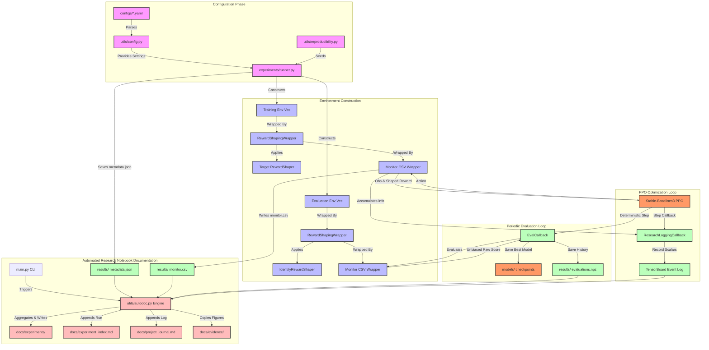

# Architecture Pipeline Diagram

The following Mermaid diagram visualizes the data flow, control relationships, and execution boundaries between Gymnasium, our wrappers, the SB3 PPO agent, the logger callbacks, and the automated documentation engine.

