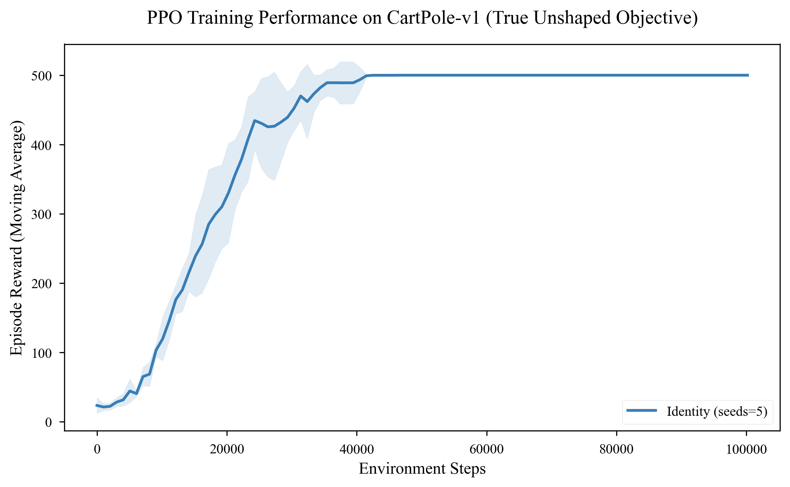
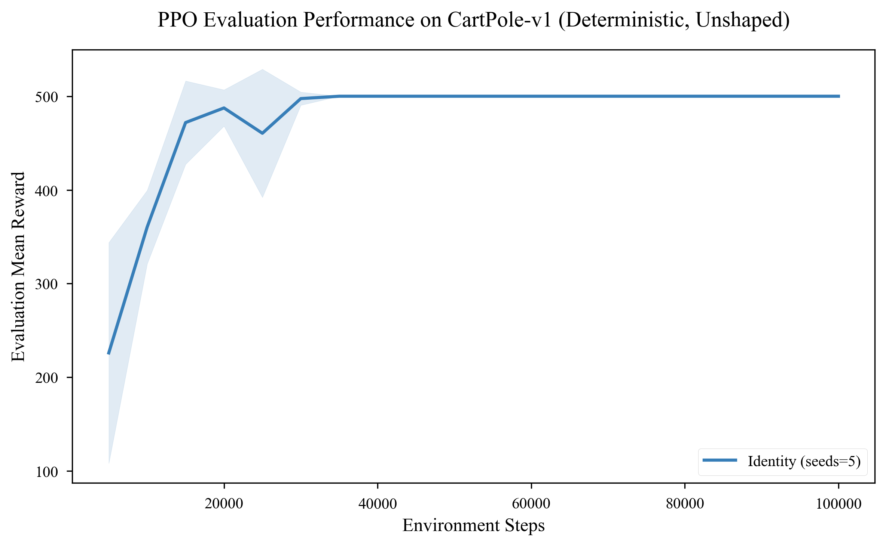
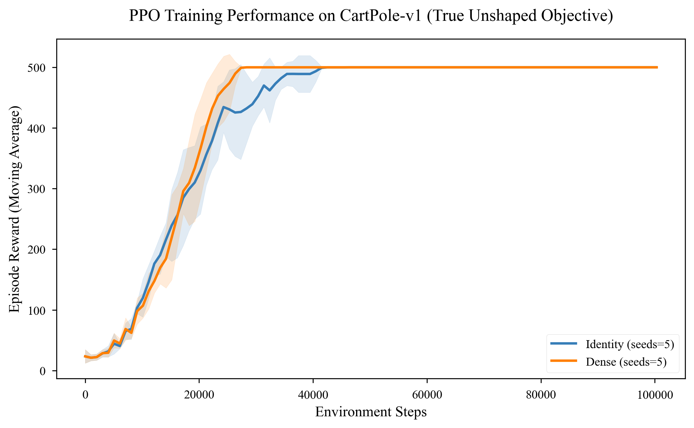
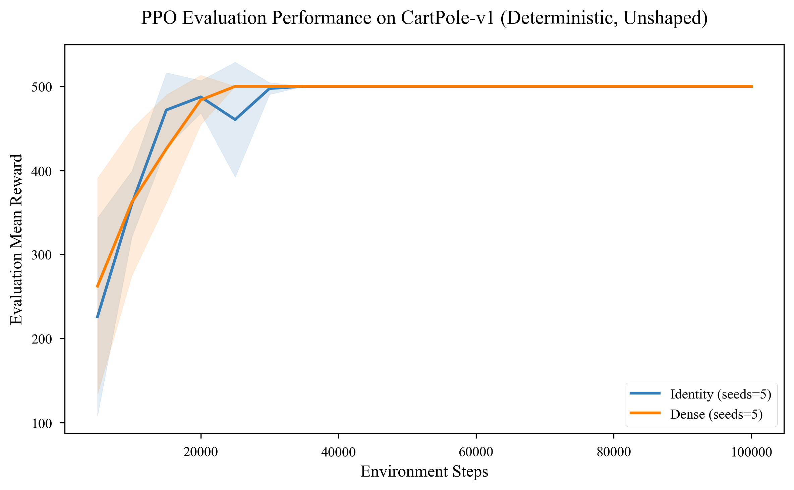

## Artifact: CartPole-v1 - Identity Strategy Learning Curves

### 1. Cumulative Learning Curve

* **What is shown**: The rolling mean episode reward and 95% confidence interval (shaded region) across all evaluated seeds.
* **Why it matters**: Demonstrates the training convergence rate and runtime variance. For Identity, the exploration phase ends around 20,000 steps, followed by a steep learning trajectory that caps at the maximum reward (500) near 35,000 steps.
* **Conclusion**: Baseline PPO stably converges on CartPole-v1 without shaping, establishing a ceiling reward of 500.00.

### 2. Evaluation Curve (Deterministic)

* **What is shown**: Deterministic evaluation rewards recorded every 5,000 steps on an unshaped environment.
* **Why it matters**: Represents unbiased generalization performance. By step 30,000, the evaluation score hits 500, demonstrating that the policy is fully optimized.
* **Conclusion**: The policy generalizes stably and reaches optimality, confirming the validity of the baseline settings.

---

## Artifact: CartPole-v1 - Dense Strategy Learning Curves

### 1. Cumulative Learning Curve

* **What is shown**: The rolling mean episode reward and 95% confidence interval across seeds for the Dense shaping run.
* **Why it matters**: Visualizes the sample efficiency gains. Compared to Identity, the exploration phase is drastically shortened, with the policy gradient finding high-reward states much earlier.
* **Conclusion**: Dense reward shaping improves convergence rate and sample efficiency on CartPole-v1.

### 2. Evaluation Curve (Deterministic)

* **What is shown**: Unbiased deterministic evaluations on the unshaped environment.
* **Why it matters**: Verifies whether the policy generalizes or is subverted. The curve climbs rapidly, proving that the dense proxy reward successfully optimizes the target unshaped task without subversion.
* **Conclusion**: Dense shaping speeds up learning without degrading final policy performance.

---
